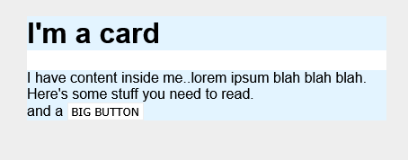
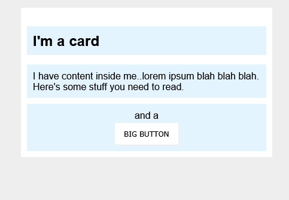

# Exercise 2 of Block and Inline

This exercise covers on how a normal looking skeletal HTML can be converted into proper and elegant using margins and paddings on them.

## Below is the completed result.

From:

To:

