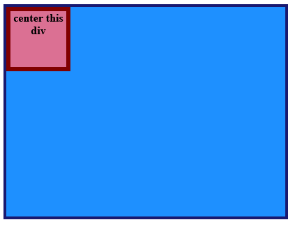
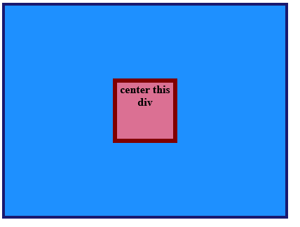

# Exercise 1 - Center a Div

This can easily be implemented by applying `display: flex` along with `justify-content: center` and `align-items: center`.

`display: flex` changes the normal flow of the DOM elements.
`justify-content: center` adjusts the child elements horizontally.
`align-items: center` adjusts the child elements vertically.

## Result of the exercise

Before:

