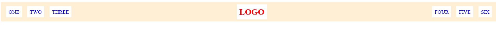

# Exercise 2 - Flex Header

This exercises shows the use of flex properties by structuring the header section, where different menus sit side by side of the Logo with an appropriate gap.

## Confusion that made me look at the solution

During the exercise I used `justify-content: space-evenly` which adds horizontal space between elements evenly around tha elements, which made the lists have same amount of space near the border of the header section.
Due to this, I had to use multiple properties to match the expected result like `margin: 0 auto` on the **Logo** to space-out the elements.

And upon reviewing the solution file, I adjusted the `justify-content` property to `space-between` and removed the additional property from the CSS file.

The result of the exercise:

