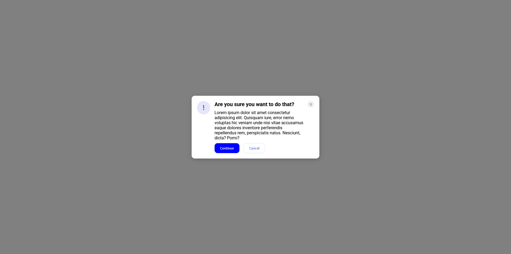

# Exercise 5 of Flex of the Foundations CSS Path

In this exercise, we were asked to create a modal using the flex porperty, which is one of the most common section found on the websites.
For the initial layout, I have created the html and css stylings by myself without the ready-made layout provided in the exercise folder.
However, I used the colors and fonts provided to match the one shown in the demo of the exercise.
As I created the layout without reviewing or seeing the ready-made layout, there were some differences:

1. I divided the main layout into three parts: `!` icon, `main-content`, and `close-button`.
2. Since the layout is divided into three parts, the paragraph doesn't extend to the right-end of the modal.

#### Current Result

Result:

## Updated Layout following the suggestions on the solution folder
