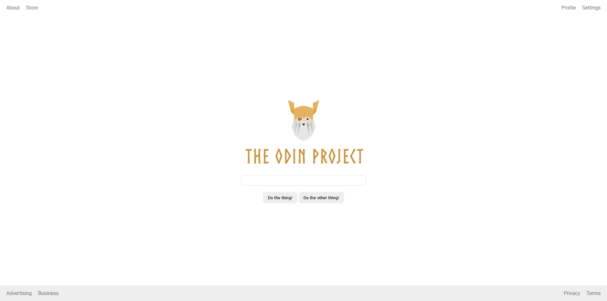

# Exercise 6 Flex Layout of the Foundations CSS path

In this exercise, we were asked to create a layout using only Flex properties and some styling to match the desired output layout shown in the screenshot.
I have created the layout without using the provided ready-made HTML structure and some of the CSS stylings in the exercises folder.
However, there were some CSS stylings I used from the provided exercises folders like stylings for the `<input>` element and width reference for the logo which was `600px`.

#### Completed Result of the layout.

